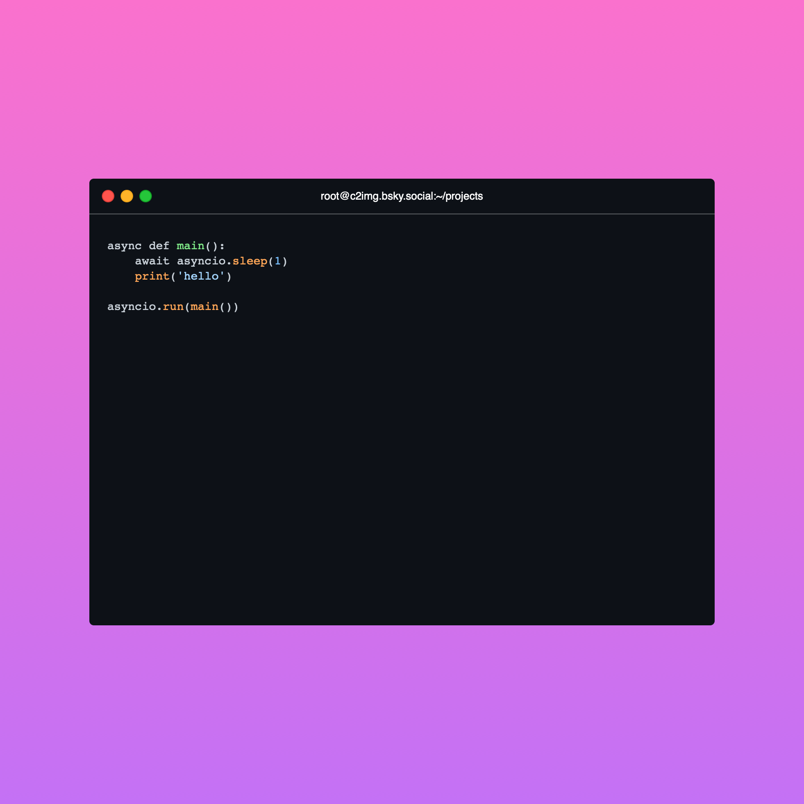
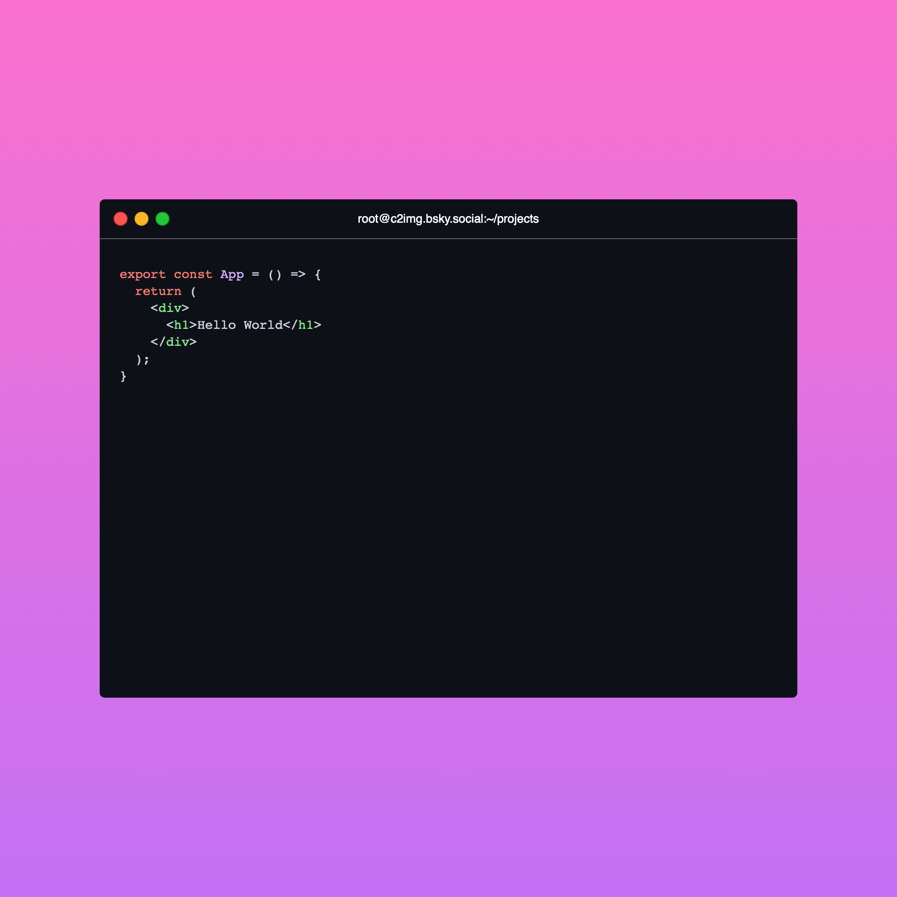
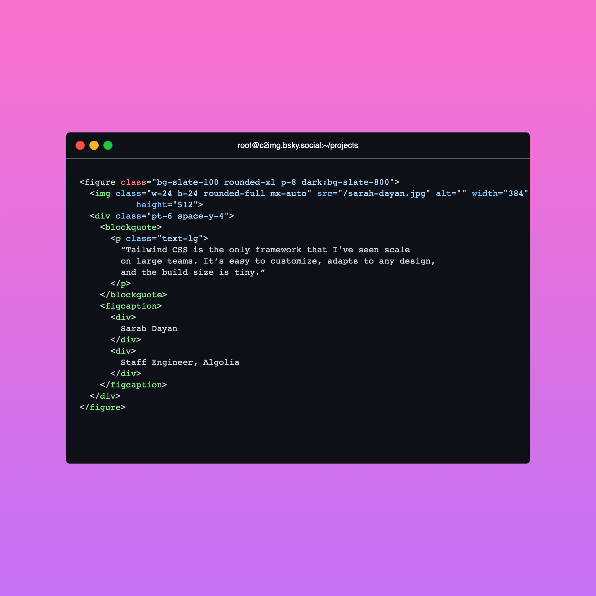
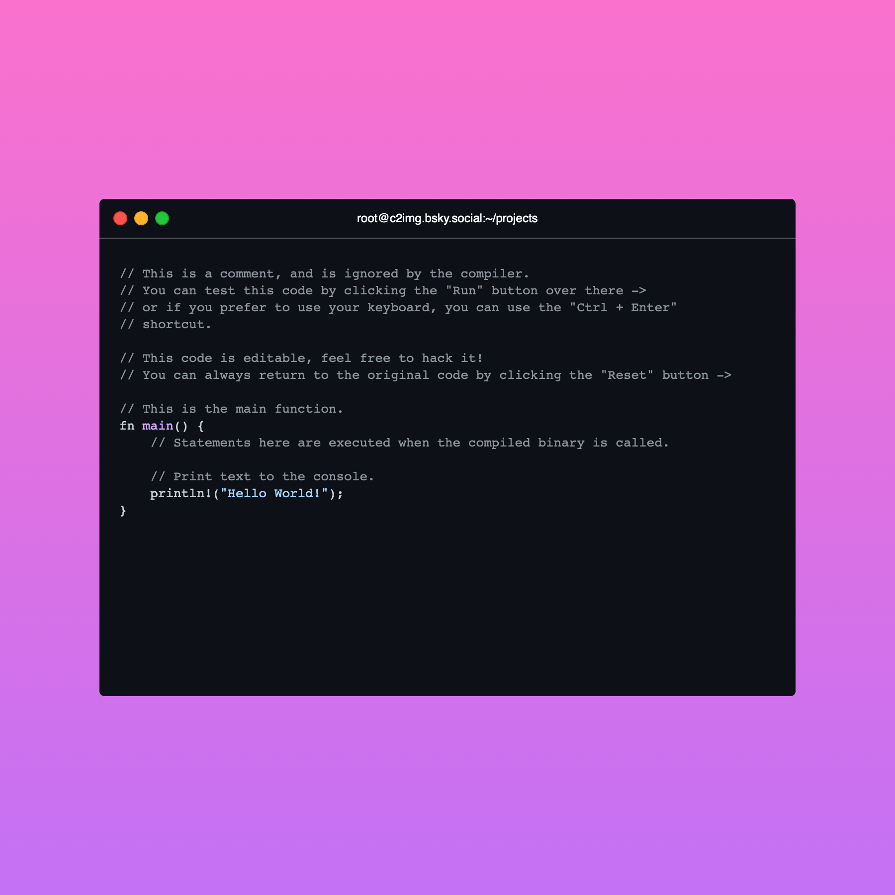

# core


<!-- WARNING: THIS FILE WAS AUTOGENERATED! DO NOT EDIT! -->

------------------------------------------------------------------------

<a
href="https://github.com/callmephilip/c2i/blob/master/c2i/core.py#L14"
target="_blank" style="float:right; font-size:smaller">source</a>

### generate_screenshot

>  generate_screenshot (code, code_file='./playground.html',
>                           screenshots_dir='./screenshots')

``` python
from IPython.display import Image

async def demo(code):
  img = await generate_screenshot(code=code)
  return Image(filename=img)
```

# Fairly short python example

``` python
await demo("""async def main():
    await asyncio.sleep(1)
    print('hello')

asyncio.run(main())""")
```



# A small React component

``` python
await demo("""
export const App = () => {
  return (
    <div>
      <h1>Hello World</h1>
    </div>
  );
}
""")
```



# A bunch of tailwind stuff

``` python
await demo("""<figure class="bg-slate-100 rounded-xl p-8 dark:bg-slate-800">
  
  <div class="pt-6 space-y-4">
    <blockquote>
      <p class="text-lg">
        “Tailwind CSS is the only framework that I've seen scale
        on large teams. It’s easy to customize, adapts to any design,
        and the build size is tiny.”
      </p>
    </blockquote>
    <figcaption>
      <div>
        Sarah Dayan
      </div>
      <div>
        Staff Engineer, Algolia
      </div>
    </figcaption>
  </div>
</figure>""")
```



# A little bit of Rust

``` python
await demo("""// This is a comment, and is ignored by the compiler.
// You can test this code by clicking the "Run" button over there ->
// or if you prefer to use your keyboard, you can use the "Ctrl + Enter"
// shortcut.

// This code is editable, feel free to hack it!
// You can always return to the original code by clicking the "Reset" button ->

// This is the main function.
fn main() {
    // Statements here are executed when the compiled binary is called.

    // Print text to the console.
    println!("Hello World!");
}""")
```



``` python
# try with resolution: 513 x 513
```
